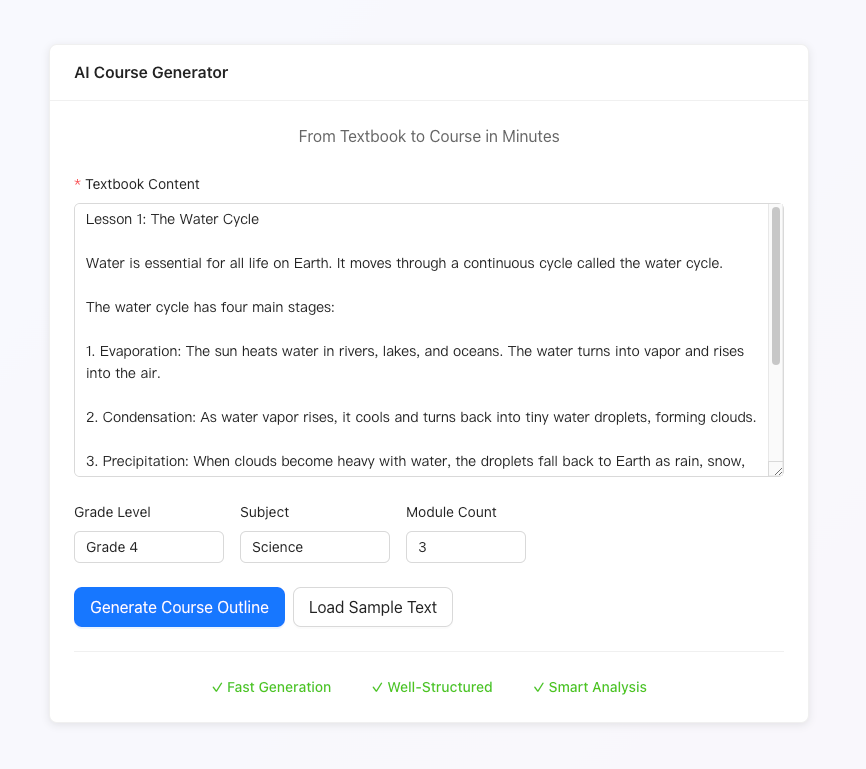
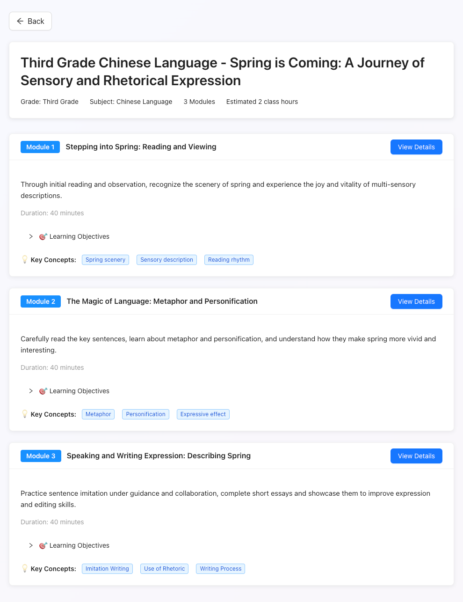
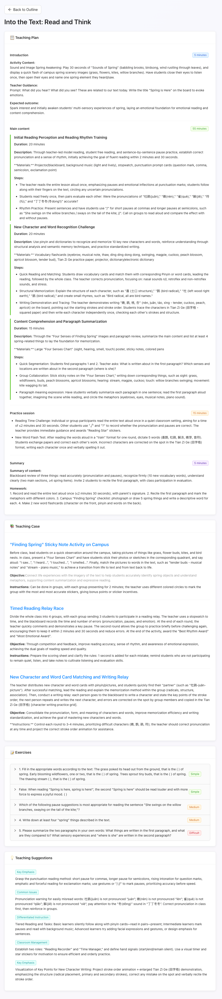

# AI Course Generator

English | [简体中文](./README-ZH.md)

An AI-powered educational tool built on the iFLYTEK Astron Agent open-source platform, designed to help teachers quickly generate clear course outlines and high-quality teaching content from textbook materials.

## Introduction

This tool leverages the iFLYTEK Astron Agent open-source platform to:
- 📚 Accept textbook content input
- 🎯 Automatically generate structured course outlines
- 📝 Create detailed teaching plans, examples, and exercises for each module
- 💡 Provide teaching suggestions for educators

## Demo

### Home - Input Textbook Content


### Course Outline Display


### Module Details


## Technology Stack

### Backend
- **Framework**: FastAPI (Python 3.10+)
- **HTTP Client**: httpx (async)
- **Data Validation**: Pydantic
- **AI Platform**: iFLYTEK Astron Agent Open Platform

### Frontend
- **Framework**: React 18 + TypeScript
- **Build Tool**: Vite
- **UI Library**: Ant Design 5
- **HTTP Client**: Axios
- **Internationalization**: i18next + react-i18next

## Quick Start

### Prerequisites

Before you begin, make sure you have:

- ✅ Python 3.10 or higher installed
- ✅ Node.js 16 or higher installed
- ✅ Successfully deployed iFLYTEK Astron Agent development platform locally
- ✅ Created and published workflows in the iFLYTEK Astron Agent platform

### 1. Clone the Repository

```bash
git clone https://github.com/GitHubDaily/AI-Course-Generator.git
cd ai-course-generator
```

### 2. Configure Backend

```bash
cd backend

# Install dependencies
pip install -r requirements.txt

# Configure environment variables
cp .env.example .env
# Edit the .env file and fill in your iFLYTEK Astron API credentials and workflow IDs

# Start the backend service
uvicorn main:app --reload
```

The backend will start at `http://localhost:8000`.

### 3. Configure Frontend

```bash
cd frontend

# Install dependencies
npm install

# Configure environment variables (optional, defaults to localhost:8000)
cp .env.example .env.local

# Start development server
npm run dev
```

The frontend will start at `http://localhost:5173`.

### 4. Access the Application

Open your browser and navigate to `http://localhost:5173` to start using the application!

## User Guide

### Generate Course Outline

1. Paste or type textbook content in the input box on the home page
2. (Optional) Fill in grade level, subject, and desired number of modules
3. Click the "Generate Course Outline" button
4. Wait for AI processing and view the generated outline

### View Module Details

1. On the outline page, click the "View Details" button for any module
2. The system will generate detailed teaching content for that module
3. Review teaching plans, examples, exercises, and teaching suggestions

### Switch Language

Click the language switcher button in the top-right corner to toggle between Chinese and English interface.

## Project Structure

```
ai-course-generator/
├── backend/                 # Backend service
│   ├── main.py             # FastAPI main application
│   ├── config.py           # Configuration management
│   ├── models.py           # Data models
│   ├── workflow_client.py  # Workflow client
│   ├── requirements.txt    # Python dependencies
│   ├── .env               # Environment variables
│   └── README.md          # Backend documentation
├── frontend/               # Frontend application
│   ├── src/
│   │   ├── components/    # React components
│   │   ├── services/      # API services
│   │   ├── types/         # Type definitions
│   │   ├── i18n/          # Internationalization config
│   │   ├── App.tsx        # Main application
│   │   └── main.tsx       # Entry file
│   ├── package.json       # Frontend dependencies
│   └── README.md          # Frontend documentation
├── docs/                   # Project documentation
└── README.md              # This file
```

## API Documentation

After starting the backend, access the API documentation at:
- Swagger UI: http://localhost:8000/docs
- ReDoc: http://localhost:8000/redoc

## Environment Variables

### Backend (.env)

```env
# Application information from local Astron Agent platform
Astron_API_KEY=your_api_key
Astron_API_SECRET=your_api_secret

# Workflow IDs
WORKFLOW_1_ID=your_workflow_1_id  # Course outline generation
WORKFLOW_2_ID=your_workflow_2_id  # Module details generation

# Server configuration
BACKEND_PORT=8000
CORS_ORIGINS=http://localhost:3000,http://localhost:5173
```

### Frontend (.env.local)

```env
VITE_API_BASE_URL=http://localhost:8000
```

## Development Progress

- [x] Backend framework
- [x] Workflow client wrapper
- [x] Data model definition
- [x] API endpoint implementation
- [x] Frontend project setup
- [x] UI component development
- [x] API integration
- [x] Internationalization (Chinese/English)
- [x] Testing and optimization
- [x] Deployment documentation

## Important Notes

1. **API Credentials**: Valid iFLYTEK Astron API credentials are required
2. **Workflows**: Workflows must be created and configured in the local iFLYTEK Astron Agent platform beforehand
3. **Timeout Settings**: API call timeout is set to 120 seconds
4. **Text Length**: Recommended maximum textbook content length per request is 10,000 characters

## FAQ

### 1. Backend Fails to Start
- Check if Python version is >= 3.10
- Verify environment variables in .env file are correctly configured
- Review terminal error messages

### 2. Frontend Cannot Connect to Backend
- Confirm backend service is running
- Check if API address in .env.local is correct
- Review browser console network requests

### 3. Generation Fails
- Verify iFLYTEK Astron API credentials are valid
- Confirm workflow IDs are correct
- Check backend logs for detailed errors

## Contributing

Issues and Pull Requests are welcome!

## License

MIT License

## Contact

For questions, please submit an Issue or contact the development team.

---

**Development Documentation**: Check the `docs/` directory for more details

**Quick Start Checklist**: `docs/Quick Start Checklist - Claude.md`

**Product Requirements Document**: `docs/RPD.md`
